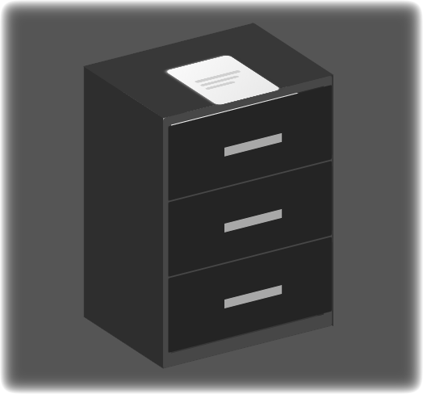

<p align="center">
  
</p>

# Simnote

A beautifully animated journaling companion that pairs mindful writing with mood tracking, guided prompts, and ambient audio to create a calming daily ritual.

## Table of Contents
1. [Overview](#overview)
2. [Highlights](#highlights)
3. [Tech Stack](#tech-stack)
4. [Getting Started](#getting-started)
5. [Development Workflow](#development-workflow)
6. [Build & Distribution](#build--distribution)
7. [Project Structure](#project-structure)
8. [Data & Storage](#data--storage)
9. [Assets & Media](#assets--media)
10. [License](#license)

## Overview
Simnote is an Electron-powered desktop experience crafted for thoughtful journaling. It blends hand‑drawn animations, seasonal themes, ambient sounds, and intelligent insights into a single distraction-free workspace. Whether you are jotting down a quick note or performing a full mood check-in, Simnote keeps everything synced locally for privacy while still feeling polished and modern.

## Highlights
- **Immersive journaling UI** – animated backgrounds, handwriting overlays, and tactile transitions powered by custom animators (Aurora, Sakura, Fireflies, Lavender, Plain variants, and more).
- **Daily mood check-ins** – lightweight prompts the moment the main panel is ready, complete with emoji suggestions via the `MoodEmojiMapper` utility.
- **Mood analytics & insights** – `MoodAnalyticsEngine`, `MoodInsightsManager`, and stability/stress engines surface trends, volatility, and attribute correlations across your entries.
- **Attribute tagging** – `MoodAttributesManager` provides an iOS-style jiggle grid where you can select, reorder, and customize the drivers behind each mood.
- **Guided prompts & templates** – `GuidedPromptManager` and `TEMPLATES` offer structured journaling flows alongside free-form writing.
- **Offline-first storage** – `StorageManager` seamlessly chooses between localStorage, SQLite, or the native Electron DB bridge for dependable persistence.
- **Delightful audio feedback** – curated sound effects (drawer openings, quote cards, recording cues, welcome chimes) enhance the ritual without being distracting.

## Tech Stack
- **Runtime:** Electron 25 with custom preload bridge.
- **Frontend:** Vanilla JS modules, rich CSS (panels, themes, typography), and HTML-based UI with animated SVG/Canvas components.
- **Storage:** `better-sqlite3`, localStorage fallbacks, and native Electron IPC bindings.
- **Tooling:** `electron-packager`, `electron-builder`, and `electron-rebuild` for native modules.

## Getting Started
1. **Install dependencies**
   ```bash
   npm install
   ```
2. **Run the desktop app in development**
   ```bash
   npm start
   ```
   This launches the Electron shell, loads `index.html`, and wires up the preload APIs plus all managers.

### Optional prerequisites
- Node.js ≥ 18 (for ES modules and Electron 25 compatibility)
- macOS/Windows/Linux with graphics acceleration enabled

## Development Workflow
Key npm scripts defined in `package.json`:
- `npm start` – run Electron in dev mode.
- `npm run pack` – create a packaged win32 build via `electron-packager`.
- `npm run dist` – produce distributables for the configured platforms using `electron-builder`.
- `npm run rebuild:electron` – recompile native dependencies (useful after upgrading Electron).

During development you can:
- Edit panels and components under `css/` and `js/` (each feature typically has its own manager).
- Use the in-app manual/theme buttons to preview transitions and guided flows once the splash animation completes.
- Toggle mood check-ins by setting `localStorage.simnote_mood_checkin_enabled`.

## Build & Distribution
The `build` block in `package.json` is configured for:
- **Windows:** NSIS installers.
- **macOS:** Signed DMG targets (arm64 + x64) with hardened runtime support and `resources/icon.icns` branding.
- **Linux:** AppImage packaging.

Artifacts are emitted to the `dist/` folder. The build uses ASAR with selective unpacking for `better-sqlite3` binaries.

## Project Structure
```
Simnote/
├─ css/                 # Panel, component, theme styles (core, journal, entries, etc.)
├─ js/
│  ├─ animators/        # Background + splash animations
│  ├─ managers/         # Feature controllers (editor, mood, stats, onboarding, panels)
│  ├─ analytics/        # Mood analytics, stability, stress engines
│  ├─ core/             # App bootstrap, templates, i18n, keyboard handling
│  └─ utils/            # Helpers such as emoji mapping
├─ resources/           # Icon, audio cues, quotes dataset
├─ index.html           # Primary UI shell loaded by Electron/Web
├─ manifest.json        # PWA metadata for web build targets
├─ package.json         # Scripts, dependencies, builder config
└─ sw.js                # Service worker for offline/PWA support
```

## Data & Storage
- **Journal entries & moods** are persisted through `StorageManager`, which automatically promotes from localStorage to SQLite/native databases when available.
- **Daily moods** and history are trimmed to the latest 30–90 days for faster analytics.
- **Security:** No data leaves the device; analytics run locally inside Electron.

## Assets & Media
All visual and audio assets live in `resources/`. Key files include:
- `resources/icon.png` / `icon.icns` – branding used across the README, app window, and installers.
- `resources/quotes.json` – curated inspirational snippets used by the guided quote feature.
- `resources/*.mp3` – warm UI feedback (drawer slides, swooshes, welcome tone, etc.).

## License
Simnote is released under the [MIT License](LICENSE).
